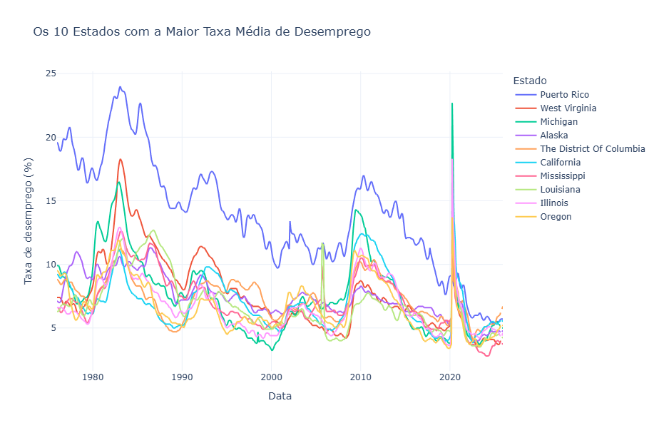
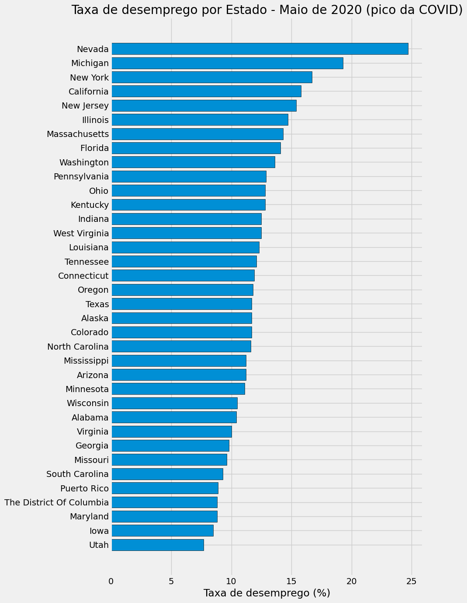

# Análise de Dados Econômicos com FRED e Python 
### Indicadores Macroeconômicos e Performance de MercadoPerformance

Projeto de análise macroeconômica utilizando a API do **FRED (Federal Reserve Economic Data)**, com foco na relação entre mercado financeiro e indicadores do mercado de trabalho dos Estados Unidos.

O objetivo é investigar como variáveis econômicas — como taxa de desemprego e taxa de participação na força de trabalho — se relacionam com o desempenho do mercado acionário, representado pelo **S&P 500**.

---

## O que é o S&P 500:

O **S&P 500 (Standard & Poor’s 500)** é um dos principais índices do mercado financeiro dos Estados Unidos.

Ele representa o desempenho das 500 maiores empresas listadas nas bolsas americanas e é amplamente utilizado como indicador da saúde da economia dos EUA.

Empresas incluídas no índice abrangem diversos setores, como:
- Tecnologia  
- Saúde  
- Energia  
- Finanças  
- Consumo  

Por isso, o S&P 500 é frequentemente utilizado como proxy do mercado acionário americano.

---

## Objetivos do Projeto:

- Analisar o comportamento histórico do S&P 500  
- Explorar a dinâmica da taxa de desemprego por estado  
- Analisar a taxa de participação na força de trabalho  
- Investigar o impacto da pandemia de 2020 no mercado de trabalho  
- Avaliar possíveis relações entre indicadores macroeconômicos e mercado financeiro  

---

## Ferramentas Utilizadas:

- Python
- Pandas
- NumPy
- Matplotlib
- Plotly
- FRED API
---

## Coleta de Dados:

Os dados foram obtidos via API do FRED:

- S&P 500 (`SP500`)
- Taxa de desemprego estadual (Seasonally Adjusted, Monthly)
- Taxa de participação na força de trabalho estadual
- Períodos de recessão (opcional para análises futuras)
---

## Tratamento de Dados:

- Conversão de índices para datetime
- Remoção de valores nulos
- Consolidação de múltiplas séries em DataFrames únicos
- Renomeação de colunas (ID → Nome do Estado)
- Padronização temporal para análise comparativa

---

## Análises Realizadas:

### 1. Série histórica do S&P 500
Visualização da evolução do mercado ao longo do tempo.

### 2. Taxa de desemprego por estado
- Download automatizado de múltiplas séries
- Consolidação em painel estadual
- Identificação dos estados com maior desemprego médio

### 3. Impacto da COVID-19
Análise da taxa de desemprego por estado em maio de 2020 (pico da crise).

### 4. Taxa de participação
Avaliação da participação da força de trabalho para identificar se quedas no desemprego refletem melhora real ou saída de trabalhadores do mercado.

---

## Conclusões:

- O choque da COVID-19 causou aumento abrupto do desemprego em praticamente todos os estados.
- Estados apresentam diferentes velocidades de recuperação.
- Taxa de participação é essencial para interpretar corretamente a taxa de desemprego.
- Indicadores do mercado de trabalho podem apresentar relação com ciclos do mercado acionário.
---

